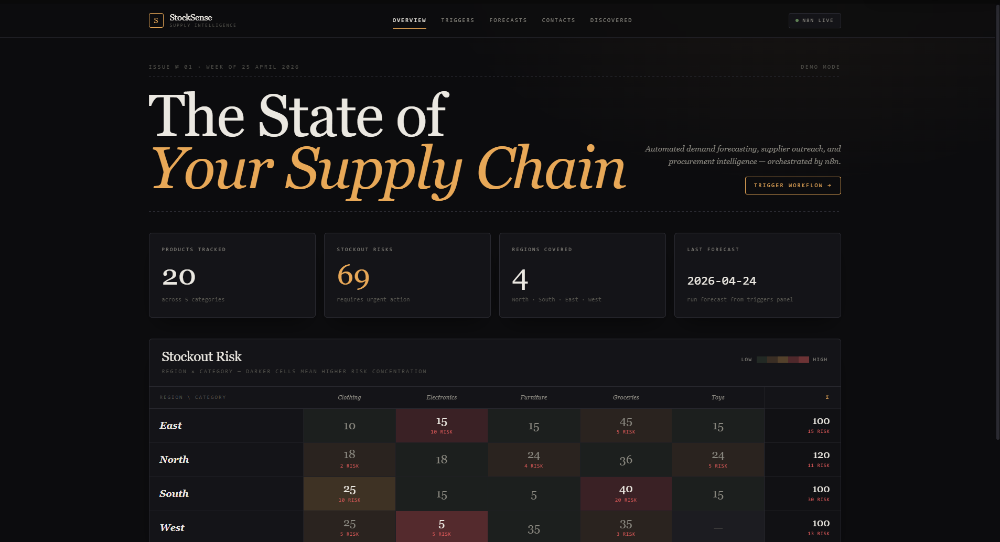

# StockSense

> **Supply-chain autopilot for retail.** Forecasts demand, contacts suppliers, discovers new sourcing leads — all automated.


        
        
        



## What this is

StockSense is a retail supply-chain autopilot built for UMHackathon in 2026. It automates three things every retailer does manually:

1. **Demand Forecasting** — reads historical stock data and uses GLM-5.1 to predict next-period demand per product per region, with confidence scores and stockout risk flags.
2. **Supplier Outreach** — when stockout risk is flagged, it automatically sends personalised order-request emails to the right suppliers, logging every contact.
3. **Supplier Discovery** — once a week, it searches the web for new suppliers in at-risk categories, validates their contact details, and emails a curated digest to the supply manager.

## The unusual part

**The entire backend is n8n.**

No custom Node server, no FastAPI, no serverless functions. Every piece of business logic — LLM calls, email sending, data aggregation, deduplication, rate-limit handling — lives as a visual workflow. The Next.js frontend is a thin shell that talks to n8n over webhooks.

### Why we chose n8n as a backend

Most hackathon projects burn 60% of their build time on backend plumbing — ORM setup, migrations, API scaffolding, auth, deploy pipelines. We traded that for:

- **Visual debugging** — every LLM call, sheet write, and email send is inspectable in the execution log
- **Zero boilerplate** — Google Sheets + Gmail + HTTP integrations wire up in minutes
- **Observable AI pipelines** — when GLM-5.1 returned malformed JSON or hit Ilmu's 60-second Cloudflare timeout, we could see exactly where and why
- **Portable workflows** — the whole system ships as 10 JSON files anyone can import

Is it weird? Yes. Does it work? Also yes.

## Architecture

```
┌─────────────────────┐      ┌─────────────────────┐      ┌──────────────────┐
│   Next.js frontend  │      │    n8n (backend)    │      │   Data & LLMs    │
│                     │      │                     │      │                  │
│  ┌───────────────┐  │      │  ┌───────────────┐  │      │ ┌──────────────┐ │
│  │ Overview      │  │      │  │ Webhook API   │  │─────>│ │ Google Sheets│ │
│  │ Triggers      │─POST──> │  │ (6 endpoints) │  │      │ │  (database)  │ │
│  │ Forecasts     │  │ JSON │  └───────┬───────┘  │      │ └──────────────┘ │
│  │ Contacts      │<─GET────│          │          │      │                  │
│  │ Discovered    │  │      │          ▼          │      │ ┌──────────────┐ │
│  └───────────────┘  │      │  ┌───────────────┐  │      │ │ ILMU GLM-5.1 │ │
│                     │      │  │ WF-1 Forecast │──┼─────>│ │ (forecasts + │ │
│  /api/trigger/*     │      │  │ WF-2 Contact  │  │      │ │  newsletter) │ │
│  /api/data/*        │      │  │ WF-3 Discover │  │      │ └──────────────┘ │
│  (proxies to n8n)   │      │  └───────────────┘  │      │                  │
└─────────────────────┘      └─────────────────────┘      │ ┌──────────────┐ │
                                                          │ │    Gmail     │ │
                                                          │ │  (outbound)  │ │
                                                          │ └──────────────┘ │
                                                          │                  │
                                                          │ ┌──────────────┐ │
                                                          │ │   SerpApi    │ │
                                                          │ │ (web search) │ │
                                                          │ └──────────────┘ │
                                                          └──────────────────┘
```

## Demo

[Live demo link — if deployed]

### Key flows

| Flow | Trigger | Duration | What happens |
|------|---------|----------|--------------|
| Forecast | Manual / cron | ~6–8 min | Reads `stock_data`, groups by region, calls GLM-5.1 in rate-limited batches, writes 80 forecasts to `forecast_results` |
| Supplier contact | After forecast | ~30s per email | Finds urgent stockout items, dedups against previous contacts, sends HTML emails, logs to `supplier_contact_logs` |
| Newsletter | Weekly | ~2 min | SerpApi searches per category → extracts emails from snippets → GLM-5.1 drafts intro → sends digest → logs to `supplier_discovery_log` |

## Setup

### Prerequisites

- Node.js 18+
- Docker (for n8n)
- Google account (Sheets + Gmail)
- API keys: [ILMU](https://ilmu.ai), [SerpApi](https://serpapi.com)

### 1. Clone

```bash
git clone https://github.com/schizoalloy/stocksense.git
cd stocksense
```

### 2. Run n8n in Docker

```bash
docker run -d \
  --name stocksense-n8n \
  -p 5678:5678 \
  -v n8n_data:/home/node/.n8n \
  -e EXECUTIONS_TIMEOUT=600 \
  -e WEBHOOK_URL=http://localhost:5678/ \
  n8nio/n8n
```

Open http://localhost:5678, create an owner account.

### 3. Import workflows

In n8n: **+ Add workflow → Import from File** — do this 10 times, once per file in `n8n-workflows/`.

For each imported workflow:
1. Click each node that uses credentials (Google Sheets, Gmail, HTTP Request with auth)
2. Connect your own credentials
3. Activate the workflow (toggle top-right)

### 4. Set up Google Sheets

1. Upload `google-sheets-template/StockSense_Data.xlsx` to Google Drive
2. Open it as a Google Sheet
3. Copy the sheet ID from the URL (the long alphanumeric part)
4. Update the sheet ID in the n8n workflows' Google Sheets nodes

### 5. Configure and run the frontend

```bash
cd frontend
npm install
cp .env.example .env.local
```

Edit `.env.local`:
```
NEXT_PUBLIC_N8N_BASE_URL=http://localhost:5678
```

```bash
npm run dev
```

Open http://localhost:3000. Hit **Triggers → Run Forecast** to see the whole system light up.

Detailed setup: [`docs/N8N_SETUP.md`](docs/N8N_SETUP.md)

## Stack

**Frontend**
- Next.js 15 (App Router) + TypeScript
- Tailwind CSS v4
- React Server Components for data fetching
- Editorial dark theme with Fraunces display serif + JetBrains Mono

**Backend (n8n)**
- 4 business-logic workflows (master + forecast + supplier contact + discovery)
- 6 webhook API workflows (3 triggers + 3 data reads)
- Google Sheets as the primary data store

**AI & external services**
- ILMU GLM-5.1 — demand forecasting + newsletter copy
- SerpApi — web search for supplier discovery
- Gmail API — outbound email

## Challenges we solved

- **Ilmu's 60-second Cloudflare timeout** → sequential batch processing (5 products per request) with retry-on-fail
- **GLM-5.1 returning malformed JSON** → strict JSON-mode prompting + defensive parsing with fallbacks
- **Email extraction from random supplier sites** → discovered SerpApi's `snippet_highlighted_words` already contains validated emails; skipped HTML scraping entirely
- **CORS between frontend and n8n** → routed every call through Next.js API routes as a proxy

## Roadmap

- [ ] Replace Google Sheets with Postgres for production use
- [ ] Add authentication (NextAuth.js)
- [ ] Real-time workflow status via Server-Sent Events
- [ ] Multi-tenant (different businesses, their own data)
- [ ] Mobile-friendly responsive layout

## License

MIT — see [LICENSE](LICENSE).

## Credits

Built by Muhammad Ali and Eunhye Oh for UMHackathon, April 2026.

Powered by [n8n](https://n8n.io), [ILMU](https://ilmu.ai), [SerpApi](https://serpapi.com), and a lot of GLM 5.1 tokens.
